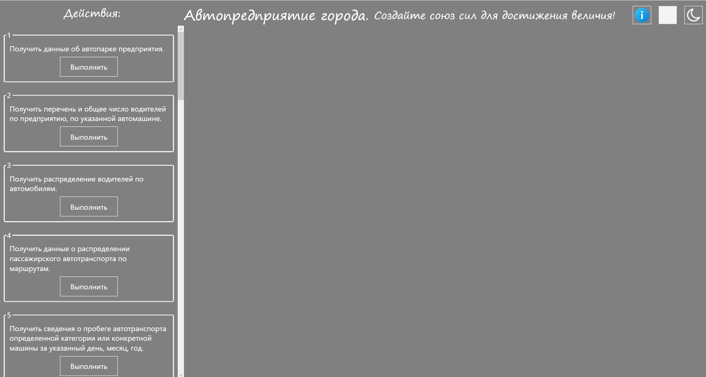
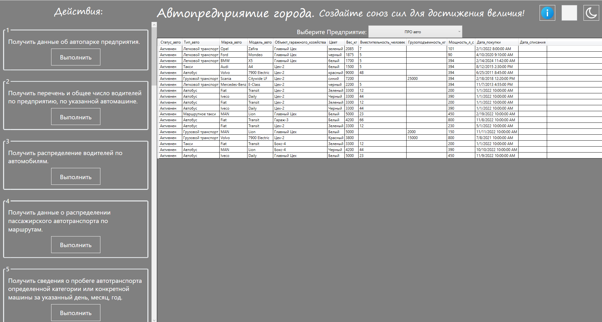
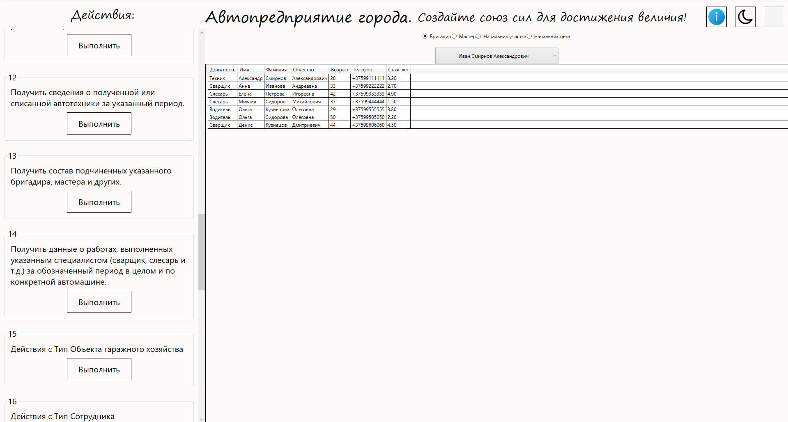
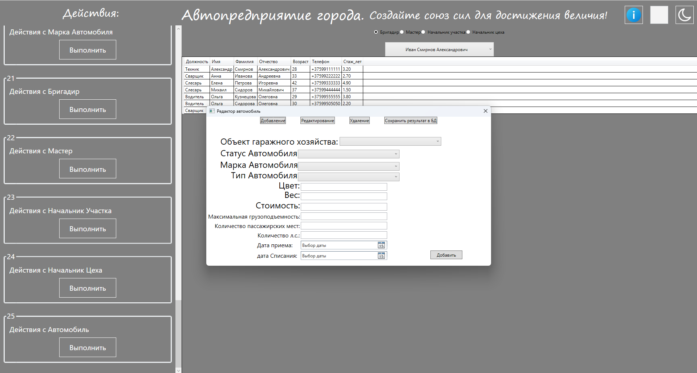
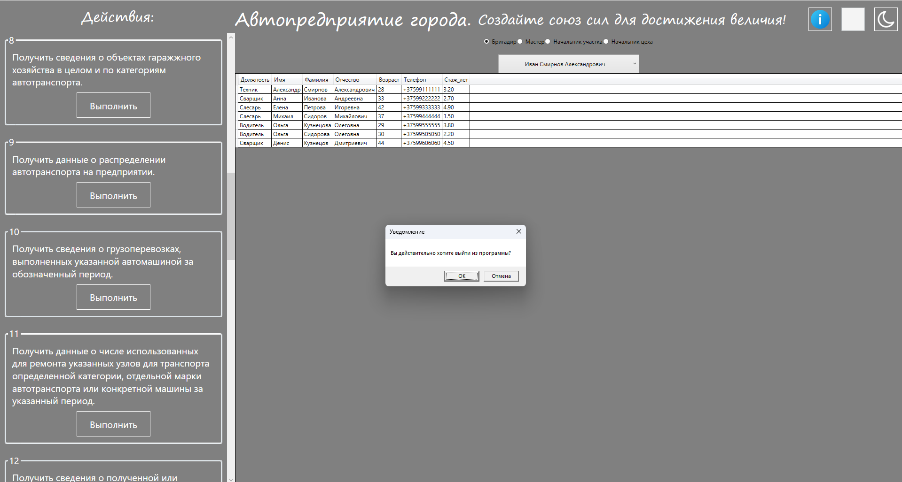

# Курсовой проект "Автопредприятие города"

> Проект на платформе WPF c использованием фреймворка EF.

## Тема курсового проекта

>Автопредприятие города занимается организацией пассажирских и
>грузовых перевозок внутри города. В ведении предприятия находится
>автотранспорт различного назначения: автобусы, такси, маршрутные такси,
>прочий легковой транспорт, грузовой транспорт, транспорт вспомогательного
>характера, представленный различными марками. Каждая из перечисленных
>категорий транспорта имеет характеристики, свойственные только этой
>категории: например, к характеристикам только грузового транспорта
>относится грузоподъемность, пассажирский транспорт характеризуется
>вместимостью и т.д. С течением времени, с одной стороны, транспорт стареет
>и списывается (возможно, продается), а с другой, - предприятие пополняется
>новым автотранспортом.

>Предприятие имеет штат водителей, закрепленных за автомобилями (за
>одним автомобилем может быть закреплено более одного водителя).
>Обслуживающий персонал (техники, сварщики, слесари, сборщики и др.)
>занимается техническим обслуживанием автомобильной техники, при этом
>различные вышеперечисленные категории также могут иметь уникальные для
>данной категории атрибуты. Обслуживающий персонал и водители
>объединяется в бригады, которыми руководят бригадиры, далее следуют
>мастера, затем начальники участков и цехов. В ведении предприятия находятся
>объекты гаражного хозяйства (цеха, гаражи, боксы и пр.), где содержится и
>ремонтируется автомобильная техника.

>Пассажирский автотранспорт (автобусы, маршрутные такси) перевозит
>пассажиров по определенным маршрутам, за каждым из них закреплены
>отдельные единицы автотранспорта. Ведется учет числа перевозимых
>пассажиров, на основании чего производится перераспределением транспорта
>с одного маршрута на другой. Учитывается также пробег, число ремонтов и
>затраты на ремонт по всему автотранспорту, объем грузоперевозок для
>грузового транспорта, интенсивность использования транспорта
>вспомогательного назначения. Учитывается интенсивность работы бригад по
>ремонту (число ремонтов, объем выполненных работ), число замененных и
>отремонтированных узлов и агрегатов (двигателей, КП, мосты, шасси и т.д.) по
>каждой автомашине, и суммарно по участку, цеху, предприятию.

Виды запросов в информационной системе:
* Получить данные об автопарке предприятия;
* Получить перечень и общее число водителей по предприятию, по указанной автомашине;
* Получить распределение водителей по автомобилям;
* Получить данные о распределении пассажирского автотранспорта по маршрутам;
* Получить сведения о пробеге автотранспорта определенной категории или конкретной автомашины за указанный день, месяц, год;
* Получить данные о числе ремонтов и их стоимости для автотранспорта определенной категории, отдельной марки автотранспорта или указанной автомашины за указанный период;
* Получить данные о подчиненности персонала: рабочие - бригадиры - мастера - начальники участков и цехов;
* Получить сведения о наличии гаражного хозяйства в целом и по каждой категории транспорта;
* Получить данные о распределении автотранспорта на предприятии;
* Получить сведения о грузоперевозках, выполненных указанной автомашиной за обозначенный период;
* Получить данные о числе использованных для ремонта указанных узлов и агрегатов для транспорта определенной категории, отдельной марки автотранспорта или конкретной автомашины за указанный период;
* Получить сведения о полученной и списанной автотехники за указанный период;
* Получить состав подчиненных указанного бригадира, мастера и пр.
* Получить данные о работах, выполненных указанным специалистом (сварщиком, слесарем и т.д.) за обозначенный период в целом и по конкретной автомашине.

## Главне окно приложения

</img>

## Пример запроса

</img>

## Смена темы на светлую

</img>

## Редактирование записей таблиц

</img>

## Выход из программы (клкавиша ESC)

</img>